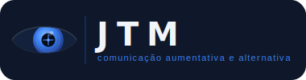

<div align="center">
  
</div>

<br/>

<div align="center">
  <strong>Em memória de João Tossiro Maeda (1952–2022)</strong>
</div>

---

## A história

Meu pai, João Tossiro Maeda, sofreu uma série de AVCs que o deixaram internado por mais de 30 dias. Já nos primeiros dias de internação ele havia perdido a fala. Havia uma possibilidade muito remota de sobreviver com sequelas — e, dentro dessas sequelas, estaria a impossibilidade de se comunicar.

Foi durante esse período que imaginei o JTM. Um app simples, acessível pelo celular, que permitisse a ele indicar o que precisava — com um toque, com um olhar, com o que ainda fosse possível. Não tinha experiência suficiente em programação para construí-lo. E então veio a reviravolta: meu pai não se recuperou. Ele faleceu, e o projeto ficou para trás junto com a dor daqueles dias.

Depois de algum tempo, experimentando o Claude, percebi que o que antes era inviável por falta de conhecimento técnico agora tinha um caminho real. O JTM voltou — não a tempo de ajudá-lo, mas com a esperança de que possa ajudar outras famílias que estejam vivendo o que eu vivi.

O nome é uma homenagem a ele: **J**oão **T**ossiro **M**aeda.

---

## O que é o JTM

O JTM é um PWA (Progressive Web App) de CAA que funciona diretamente no navegador — sem conta, sem instalação, sem custo. O usuário escolhe como quer controlar o app e começa a usar.

### Funcionalidades

| Função | Descrição |
|--------|-----------|
| **Modo Toque** | Toque direto nos botões. Ideal para quem tem alguma mobilidade nas mãos. |
| **Modo Varredura** | Botões acendem em sequência. O usuário seleciona piscando, abrindo a boca ou por tempo automático. |
| **Rastreamento ocular** | O olhar controla um cursor. O usuário olha para o botão e o mantém em foco para ativá-lo. |
| **Síntese de voz offline** | Piper TTS com voz em pt-BR. Funciona sem internet após o primeiro carregamento. |
| **Calibração personalizada** | O rastreamento ocular é calibrado sobre o layout real do app — frases e categorias — para máxima precisão. |
| **Filtro de tremor** | One Euro Filter adapta o suavizamento à velocidade do olhar: treme menos em repouso, responde rápido ao movimento intencional. |

---

## Tecnologias

| Tecnologia | Uso |
|-----------|-----|
| [Vite](https://vitejs.dev/) + [React](https://react.dev/) | Interface e build |
| [MediaPipe FaceLandmarker](https://ai.google.dev/edge/mediapipe/solutions/vision/face_landmarker) | Detecção de iris, pálpebras e boca via câmera |
| [One Euro Filter](https://gery.casiez.net/1euro/) | Filtragem adaptativa de tremor no olhar |
| [Piper TTS](https://github.com/rhasspy/piper) | Síntese de voz offline em pt-BR |
| Transformada afim (mínimos quadrados) | Calibração olhar → tela |
| [vite-plugin-pwa](https://vite-pwa-org.netlify.app/) | PWA com cache offline |

---

## Como rodar

```bash
git clone https://github.com/seu-usuario/jtm.git
cd jtm
npm install
npm run dev
```

> **HTTPS é obrigatório** para câmera e Piper TTS. O servidor de desenvolvimento já usa HTTPS local via `@vitejs/plugin-basic-ssl`. Acesse `https://localhost:3000` (aceite o certificado autoassinado).

Para build de produção:

```bash
npm run build
npm run preview
```

---

## Estrutura do projeto

```
src/
├── App.jsx              # Componente principal: grade de frases, nav de categorias, lógica de modos
├── App.css              # Estilos base, variáveis CSS de layout
├── SetupWizard.jsx      # Assistente de configuração: escolha do modo + calibração ocular
├── SetupWizard.css      # Estilos do wizard
├── GazeCursor.jsx       # Cursor de olhar com anel de progresso (dwell selection)
├── useFaceTracking.js   # Hook: MediaPipe, iris, pálpebras, boca, One Euro Filter
├── useScanning.js       # Hook: lógica de varredura (toque/piscar/boca/auto)
├── calibration.js       # Ajuste afim por mínimos quadrados + aplicação da transformada
├── tts.js               # Piper TTS offline: carregamento, OPFS cache, síntese
└── main.jsx             # Entrada React
```

---

## Próximos passos

- [ ] **Clonagem de voz** — usar uma gravação da voz original da pessoa para síntese personalizada
- [ ] **Grade editável** — permitir que cuidadores customizem frases, categorias e emojis
- [ ] **Persistência na nuvem** — grade e configurações sincronizadas entre dispositivos (Supabase)
- [ ] **Deploy público** — versão hospedada em Vercel para acesso sem instalação
- [ ] **Símbolos ARASAAC** — integrar a biblioteca oficial de pictogramas de CAA
- [ ] **Mais idiomas** — vozes e interface em outras línguas
- [ ] **Modo escuro / alto contraste** — melhor acessibilidade visual

---

## Como contribuir

Contribuições são muito bem-vindas. O JTM é feito por uma pessoa só, com tempo limitado — qualquer ajuda faz diferença.

```bash
# Fork e clone
git clone https://github.com/seu-usuario/jtm.git
cd jtm
npm install

# Crie uma branch
git checkout -b minha-contribuicao

# Faça suas alterações e abra um PR
```

**Áreas que mais precisam de ajuda:**

- **Acessibilidade**: testes com usuários reais de CAA e dispositivos assistivos
- **Eye tracking**: melhorar precisão, testar em diferentes câmeras e iluminações
- **UX / design**: tornar o app mais intuitivo para cuidadores e familiares
- **Testes**: cobertura de testes automatizados está zerada
- **Documentação**: guia de uso, vídeos de demonstração

Abra uma [issue](../../issues) para discutir antes de implementar mudanças grandes.

---

## Licença

MIT © Bruno Maeda — veja [LICENSE](LICENSE).

Este projeto é livre e gratuito. Se ele ajudar alguém a se comunicar, já valeu.
